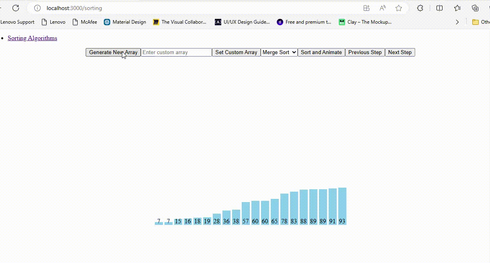

<h1 align="center">Hi 👋, I'm Anshuman Galav</h1>
<h3 align="center">A passionate Software Engineer from India</h3>

  

- 🔭 I’m currently working on [desktop assistant](https://github.com/ANSHUMANgalav/desktopaAssistant)

- 🌱 I’m currently learning **JavaScript an Node.js**

- 💬 Ask me about **Java, SpringBoot, GATE Exam.**

- 📫 How to reach me **galavanshuman@hmail.com**

- ⚡ Fun fact **I have a very serious face for a funny person.**

<h3 align="left">Connect with me:</h3>

<h3 align="left">Languages and Tools:</h3>

                   

